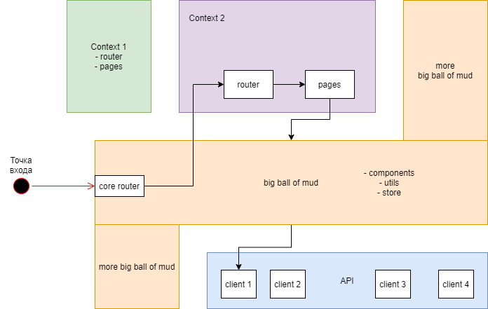
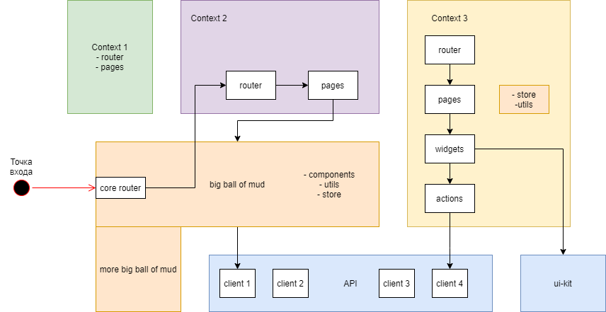

# Рефакторинг Legacy

> Бесцельный рефакторинг ведёт лишь к сжиганию человеко-часов (денег заказчика)

## Шаги
- Обновление внешних зависимостей
- Приведение структуры к порядку
    - Выделение слоя api
    - Выделение контекстов

### Приведение структуры к порядку
Если представить кодовую базу проекта в виде запутанного провода,
то, в большинстве случаев, можно найти два конца.
С них и следует начать, причем распутывать можно параллельно с каждого из концов.

В случае фронта:
- `router` - первый конец (со статическим роутером)
- `api` - второй

... #TODO

### Разделение на контексты

---
### Проработка каждого из контекстов

